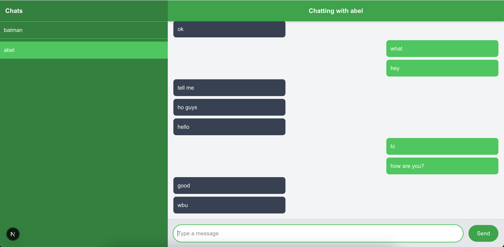
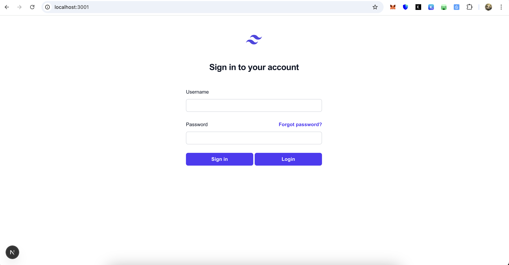

## Getting Started

First, run the backend server:

```bash
cd backend

npm run devStart
```

Then run Auth backend server :

```bash
cd auth-backend

npm run devStart
```

Then run the frontend clients (how many ever you want, each will start on a different port)

```bash
cd frontend/websocket

npm run dev
```

Now you should be able to open the frontend client (in respective ports) and sign up as a new user and chat with which all users have signed up locally.

### Chat Interface



### Sign-In Page



The DB used is MongoDB.

Copy env_sample and use it as .env. Fill in appropriate values.
